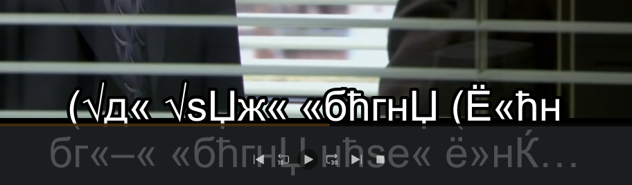

# Arabic to UTF-8 Conversion

## Description

This shell script is designed to convert all text files, particularly Arabic subtitle files (.srt), in a specified folder to UTF-8 encoding from the WINDOWS-1256 encoding. The script uses the `iconv` command to perform the conversion.

&nbsp;
## Usage/Examples


&nbsp;


&nbsp;
```shell script
chomd +x ./arabic_converter.sh
```

To make the script executable.

```shell script
./arabic_converter.sh <folder_path>
```

Replace <folder_path> with the path to the folder containing the files you want to convert. For example:

```shell script
./arabic_converter.sh /Movies/MyMovie
```

Note: The script assumes that the `iconv` command is available on your system. If it's not installed, you may need to install it using your package manager before running the script.

&nbsp;
## Options

The script does not have any additional options or flags. It only requires the folder path as a positional argument.


&nbsp;
## Behavior

1 - The script checks if the correct number of arguments is provided. If not, it displays the usage instructions.

2 - The `arabic_convert()` function is responsible for the main functionality of the script. It converts all `.srt` files in the specified folder to UTF-8 encoding.

3 - Before converting the files, the script checks if the provided folder path exists and is a valid directory.

4 - If any of the checks fail or if the user does not provide a folder path, an error message is displayed, and the script exits with an exit code of 1.

5 - If the folder and file checks pass, the script proceeds to convert each file to UTF-8 using the `iconv` command.

6 - The `file` command is used to detect the character encoding of each `.srt` file.

7 - If the detected encoding is not UTF-8, the script converts the file from WINDOWS-1256 to UTF-8 encoding using `iconv`.

8 - The converted file is saved with the same name, overwriting the original file.

&nbsp;
## Error Handling

- If the user does not provide a folder path, the script will display an error message and exit with a status code of 1.

- If the provided folder path does not exist, the script will display an error message and exit with a status code of 1.

- If the `iconv` command is not available on the system, the script will not work as expected. Make sure `iconv` is installed before running the script.

- If any error occurs during the file conversion process, the script will display an error message, but it will continue processing other files.

&nbsp;
## Notes

- This script is intended to convert Arabic subtitle files from WINDOWS-1256 to UTF-8 encoding. If you want to convert files with a different encoding or non-Arabic files, you may need to modify the script accordingly.

- The script uses the `-u` option in the shebang `(#!/bin/bash)` to exit immediately if any command returns a non-zero status (set -e). It also uses the `-e` option to treat unset variables as an error. Additionally, it uses `set -o pipefail` to propagate the exit status of the last command that returned a non-zero status in a pipeline. These options enhance the script's safety and reliability.

- Please make sure to back up your files before running this script, as it will overwrite the original files with the converted versions.

- I remove the support for `.ass` files, the script will not work for them just for the `.srt` files.

&nbsp;
## Disclaimer
The script is provided as-is, and the author takes no responsibility for any data loss or damage that may occur as a result of using this script. It is always recommended to review and understand the script before running it on critical data. If you have any concerns or doubts about the script's functionality, seek assistance from a qualified professional.
